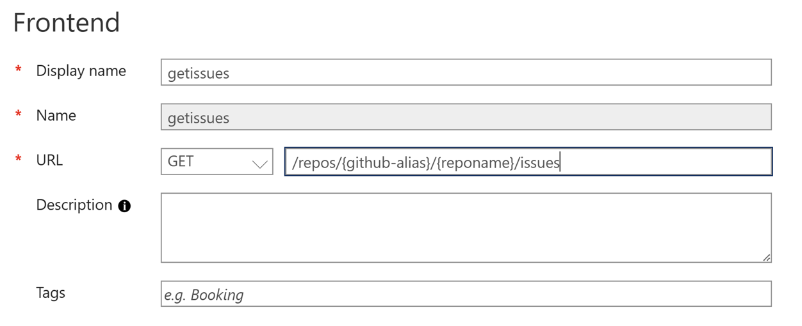

# AuthorizationsDemoAzureFunction
Web APIs have experienced an exponential increase in popularity and usage in the past few years. APIs exist at the intersection of business, products, and technologies and have transformed the way businesses interact with each other and the way they provide value to their customers. Web APIs allow businesses to access 3rd-party data, allow for cross-platform communication and seamless integration anywhere and anytime it's required, offering unmatched data processing efficiencies and cost savings.

## Azure API Management
Azure API Management accelerates the deployment, monitoring, security, and sharing of APIs in a dedicated network. It is a way to create consistent and modern API gateways for back-end services. Authorizations (along with authentication) is an important security component of your development process because it enables organizations to keep their networks secure by permitting only authenticated users (or processes) to access protected resources. Implementing authentication requires to understand these concepts and is not only very time consuming but also comes with its challenges.

## API Management Authorizations 🚀
Authorizations in API Management is a simple and reliable way to unbundle and abstract authorizations from web APIs. It greatly simplifies the process of authenticating and authorizing user's across one (or) more backend or SaaS services. With Authorizations you can easily configure OAuth, Consent, acquire tokens, cache tokens and refresh tokens without writing a single line of code. It allows you to delegate authentication to your API Management instance. This feature enables APIs to be exposed with or without a subscription key, and the authorization to the backend service uses OAuth 2.0., and reduces development costs in ramping up, implementing and maintaining security features with service integrations. API Management does all the heavy lifting for you, while you can focus on the application/domain logic.

## Authorization scenario - Time triggered Azure Function ⏳
In this repo, we will talk about an unattended scenario with Azure Functions. With our [Blog Post: Use Static Web Apps API and API Management Authorizations to integrate third party services](https://link-url-here.org](https://techcommunity.microsoft.com/t5/apps-on-azure-blog/use-static-web-apps-api-and-api-management-authorizations-to/ba-p/3603755), users are able to post a GitHub issue to a repository. We now want to implement a timer triggered function with Azure Functions that will GET the count of GitHub issues and POST about it in a Microsoft Teams channel. This will create a reminder notification in Teams about how many issues are still open:


### Prerequisites

- A running Azure API Management service instance. Check out our [Quickstart: Create a new Azure API Management service instance by using the Azure portal](https://learn.microsoft.com/en-us/azure/api-management/get-started-create-service-instance). *Note: Managed system-assigned identity must be enabled for the API Management instance.*
- [Visual Studio 2022](https://azure.microsoft.com/downloads/) (Make sure you select the **Azure development workload** during installation) or [Visual Studio Code](https://code.visualstudio.com/)

### STEP 1 - Configure Authorizations in Azure API Management
For our scenario, we need **two** API Management Authorizations, one for the **GitHub API** and one for the **Microsoft Graph API**. For the GitHub authorization, you can follow this tutorial to configure your authorization. Make sure you use the following configurations:

| Settings | Value |
| ----------- | ----------- |
| Provider name | *githubissue01* |
| Identity provider | Select **GitHub** |
| Grant type | Select **Authorization code** |
| Client id | Create a new GitHub OAuth app or use existing one from Blog Post |
| Client secret | Paste the value the GitHub Oauth app |
| Scope | *repo* |
| Authorization name | *githubissue01* |

For the Microsoft Graph authorization, you can follow this tutorial to configure your authorization. Make sure you use the following configurations:

| Settings | Value |
| ----------- | ----------- |
| Provider name | *channel-aad* |
| Identity provider | Select **Azure Active Directory** |
| Grant type | Select **Authorization code** |
| Client id | Paste the value you copied earlier from the app registration - follow tutorial for setting this up |
| Client secret | Paste the value you copied earlier from the app registration |
| Resource URL | https://graph.microsoft.com |
| Scope | *repo* |
| Authorization name | *channel-aad* |

### STEP 2 - Add your GitHub API and configure a policy
For the GitHub API, we want to add the following API:

| Settings | Value |
| ----------- | ----------- |
| Display name | *githubissue* |
| Name | *githubissue* |
| Web service URL | https://api.github.com |
| API URL suffix | *githubissue* |

| Settings | Value |
| ----------- | ----------- |
| Display name | *getissues* |
| **URL** for GET | */repos/{github-alias}/{reponame}/issues* |



Once you added the API, we can make use of the provider in the **Inbound Processing Policy** and apply the previously created Authorization. Add the following snipped to the inbound JWT policy:

```
<policies>
    <inbound>
        <base />
        <get-authorization-context provider-id="githubissue01" authorization-id="githubissue01" context-variable-name="auth-context" identity-type="managed" ignore-error="false" />
        <set-header name="Authorization" exists-action="override">
            <value>@("Bearer " + ((Authorization)context.Variables.GetValueOrDefault("auth-context"))?.AccessToken)</value>
        </set-header>
        <set-header name="User-Agent" exists-action="override">
            <value>API Management</value>
        </set-header>
    </inbound>
    <backend>
        <base />
    </backend>
    <outbound>
        <base />
    </outbound>
    <on-error>
        <base />
    </on-error>
</policies>
```

### STEP 3 - Add your Microsoft Graph API and configure a policy
For the Microsoft Graph API, we want to add the following API:

| Settings | Value |
| ----------- | ----------- |
| Display name | *TeamsChannelMessage* |
| Name | *TeamsChannelMessage* |
| Web service URL | https://api.github.com |
| API URL suffix | *TeamsChannelMessage* |

| Settings | Value |
| ----------- | ----------- |
| Display name | *postchannelmessage* |
| **URL** for POST | */v1.0/teams/{team-id}/channels/{channel-id}/messages* |


Once you added the API, we can make use of the provider in the **Inbound Processing Policy** and apply the previously created Authorization. Add the following snipped to the inbound JWT policy:
```
<policies>
   <inbound>
       <base />
       <get-authorization-context provider-id="channel-aad" authorization-id="channel-aad" context-variable-name="auth-context" identity-type="managed" ignore-error="false" />
       <set-header name="authorization" exists-action="override">
           <value>@("Bearer " + ((Authorization)context.Variables.GetValueOrDefault("auth-context"))?.AccessToken)</value>
       </set-header>
   </inbound>
   <backend>
       <base />
   </backend>
   <outbound>
       <base />
   </outbound>
   <on-error>
       <base />
   </on-error>
</policies>
```

> For more information, check out the [get-authorization-context policy references](https://learn.microsoft.com/en-us/azure/api-management/get-authorization-context-policy) to learn more about how to use the policy.


### STEP 4 - Test the APIs

1. Select your API and the operation you added previously
2. Go to the **Test** tab.
3. Select **Send**.


### STEP 5 - Building your timer triggered Azure Function

Next, we will build our timer triggered function in Azure Functions. For this, you can follow the [Quickstart: Create your first C# function in Azure using Visual Studio](https://learn.microsoft.com/en-us/azure/azure-functions/functions-create-your-first-function-visual-studio?tabs=in-process). We used the following configurations:

| Settings | Value |
| ----------- | ----------- |
| Project name | *postchannelmessage* |
| Solution name | */v1.0/teams/{team-id}/channels/{channel-id}/messages* |


Make sure to use Time trigger as the initial trigger for your Azure function.


In your [local.settings.json](FunctionAppAuth/local.settings.json) file, we will add the following code:
```
{
    "IsEncrypted": false,
  "Values": {
    "AzureWebJobsStorage": "UseDevelopmentStorage=true",
    "FUNCTIONS_WORKER_RUNTIME": "dotnet",
    "CUSTOM_URL": "YOUR_CUSTOM_URL",
    "SUBSCRIPTION_KEY": "YOUR_SUBCRIPTION_KEY",
    "TEAMS_URL": "YOUR_TEAMS_URL"
  }
}
```

In our [FunctionAppAPIMAuthTest.cs](FunctionAppAuth/FunctionAppAPIMAuthTest.cs) file, we will add the following code: 

```
using System;
using System.Net.Http;
using System.Net.Http.Formatting;
using System.Threading.Tasks;
using Microsoft.Azure.WebJobs;
using Microsoft.Extensions.Logging;
using Newtonsoft.Json.Linq;

namespace FunctionAppAPIMAuthTest
{
    public class Function1
    {
        private static HttpClient httpClient = new HttpClient();

        [FunctionName("Function1")]
        public async Task Run([TimerTrigger("*/1 * * * *")] TimerInfo myTimer, ILogger log)
        {
            log.LogInformation($"Timer trigger function started at: {DateTime.Now}");

            //Define header
            var subscriptionKey = System.Environment.GetEnvironmentVariable("SUBSCRIPTION_KEY", EnvironmentVariableTarget.Process);
            httpClient.DefaultRequestHeaders.Accept.Clear();
            httpClient.DefaultRequestHeaders.Add("Ocp-Apim-Subscription-Key", subscriptionKey);

            //Define GET URL for GET issue count
            var baseurl = System.Environment.GetEnvironmentVariable("CUSTOM_URL", EnvironmentVariableTarget.Process);
            var addurl = "?state=open";
            var _baseurl = baseurl + addurl;
            log.LogInformation($"URL: {_baseurl}");

            //GET call
            HttpRequestMessage request = new HttpRequestMessage(HttpMethod.Get, _baseurl);
            var response = await httpClient.SendAsync(request);
            JArray arr = JArray.Parse(await response.Content.ReadAsStringAsync());

            //Error handeling
            log.LogInformation($"You currently have {arr.Count} issues open.");
            if (!response.IsSuccessStatusCode)
            {
                throw new Exception($"Call unsuccessful: {response.IsSuccessStatusCode}");
            };

            //Define POST URL to POST TeamsBody to Teams
            var teamsurl = System.Environment.GetEnvironmentVariable("TEAMS_URL", EnvironmentVariableTarget.Process);
            log.LogInformation($"URL: {teamsurl}");

            // Create TeamsBody
            var TeamsBody = new
            { 
                body = new
                {
                    content = $"You currently have {arr.Count} issues open."
                }
            };
            log.LogInformation($"Body: {TeamsBody.body.content}");

            //Define POST header
            httpClient.DefaultRequestHeaders.Accept.Clear();
            httpClient.DefaultRequestHeaders.Add("Ocp-Apim-Subscription-Key", subscriptionKey);

            //POST call with TeamsBody content
            HttpRequestMessage requestteams = new HttpRequestMessage(HttpMethod.Post, teamsurl);
            requestteams.Content = new ObjectContent<object>(TeamsBody, new JsonMediaTypeFormatter());
            var responseteams = await httpClient.SendAsync(requestteams);
            log.LogInformation($"Response: {responseteams.IsSuccessStatusCode}");

            //Error handeling
            if (!responseteams.IsSuccessStatusCode)
            {
                throw new Exception($"Call unsuccessful: {responseteams.IsSuccessStatusCode}");
            };
        }
    }
}
```

> Function1 referring to your function class file.

### STEP 5 - Test Azure Function locally

Now, we can test our Azure Function locally. Hit **F5** or ▶️ and Run the function locally. You should see a message within your Microsoft Teams channel similar like this:


Let me know what you think! @[Julia](https://www.linkedin.com/in/jukasper/)


## Further Resources
- 
- 
